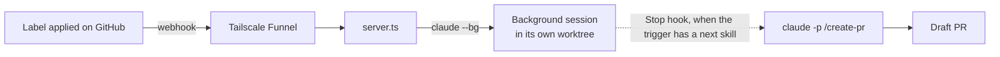

# Claude Agent Factory

Put a label on a GitHub issue or pull request. A Claude Code background session on your machine picks it up.



`TRIGGERS` in `server.ts` lists each label, the skill it starts, and the skill that runs once that session stops.

Each session is named `<label> <repo>#<number>`, for example `agent:implement cl-factory#1`.
It works in its own git worktree, `.claude/worktrees/<skill>-<number>`, so two sessions never share a checkout.
Applying the label again reuses that worktree.

## Requirements

- Node, in the range `engines` in `package.json` sets. The server runs TypeScript directly, with no build step.
- Claude Code with `claude --bg`.
- `gh`, logged in. Repo webhooks work with the default `repo` scope.
- Tailscale, logged in. The first `tailscale funnel` run prints a link to allow Funnel on your tailnet.

## Conventions for every project

The server finds everything by convention. Each repo it serves needs:

1. A clone at `$REPOS_DIR/<owner>/<repo>`, matching GitHub's `owner/repo`. With `REPOS_DIR=~/Projects/github`, `acme/app` lives at `~/Projects/github/acme/app`. Sessions run there, not in the folder the server runs from.
2. Claude Code trust. `claude --bg` refuses a folder you haven't trusted.
3. Every label `TRIGGERS` names.
4. The skills the triggers start, and the skills those call, committed and pushed. A worktree only holds committed files. `skills-lock.json` in this repo lists where each skill comes from.
5. `.claude/worktrees/` in `.gitignore`, or every session's worktree shows up as untracked in your clone.
6. A webhook to this server, using the JSON content type, the `issues` and `pull_request` events, and the secret from `.env`. One org webhook covers every repo in that org.

## Start the factory

Once per machine, from this repo:

```bash
echo "GITHUB_WEBHOOK_SECRET=$(openssl rand -hex 32)" >> .env
echo "REPOS_DIR=$HOME/Projects/github" >> .env
npm start
```

Then, in a second terminal:

```bash
tailscale funnel --bg 3456   # the PORT in server.ts
tailscale funnel status      # prints the public URL
```

`npm start` runs in the foreground, so the factory stops when its terminal closes.

For the first few minutes after you enable Funnel, webhooks can time out before they reach the server.

## Add a project

Run this from this repo so `.env` loads. The numbers match the conventions above.

```bash
set -a; . ./.env; set +a
REPO=owner/repo
FUNNEL_URL="https://$(tailscale status --json | jq -r '.Self.DNSName | rtrimstr(".")')/"

# 1. Clone to the convention path
gh repo clone "$REPO" "$REPOS_DIR/$REPO"

# 2. Trust it: accept the prompt, then /exit
(cd "$REPOS_DIR/$REPO" && claude)

# 3. Labels
gh label create issue:spec -R "$REPO" --force -d "Spec an agent implements unattended"
gh label create agent:implement -R "$REPO" --force -d "Factory: implement this spec and open a draft PR"
gh label create pr:review -R "$REPO" --force -d "Factory: review this PR"

# 6. Webhook; prints its id
gh api "repos/$REPO/hooks" \
  -f "config[url]=$FUNNEL_URL" -f 'config[content_type]=json' \
  -f "config[secret]=$GITHUB_WEBHOOK_SECRET" \
  -f 'events[]=issues' -f 'events[]=pull_request' --jq .id
```

Steps 4 and 5 change the project itself, so commit them there:

```bash
cd "$REPOS_DIR/$REPO"
npx skills@latest add <source> --skill <name>   # once per skill
echo '.claude/worktrees/' >> .gitignore
git add -A && git commit -m "chore: set up agent factory" && git push
```

Check that GitHub reaches the server. A ping answers `204`:

```bash
HOOK_ID=<id from step 6>
gh api -X POST "repos/$REPO/hooks/$HOOK_ID/pings"
gh api "repos/$REPO/hooks/$HOOK_ID/deliveries" --jq '.[0] | "\(.event) \(.status_code)"'
```

## Use it

Apply a label on GitHub. Then, on the factory machine:

```bash
claude agents        # sessions and their state
claude attach <id>   # open one in this terminal
claude rm <id>       # delete it, and its worktree when that is safe
```

Sessions start in your default Claude Code permission mode. A session waiting on an approval stays stuck until you attach to it.

To add a trigger, add a line to `TRIGGERS` in `server.ts`, create its label in each repo, and restart the server.

## Known gaps

- The next skill runs from a Stop hook, and Stop fires after every turn. A turn that ends on a question, or a follow-up message after you attach, runs `/create-pr` again. `/create-pr` only opens drafts and refuses uncommitted work.
- The PR comes from the worktree's branch, `worktree-implement-<n>`, not `spec/<n>`. Records `/create-spec` pushed to `spec/<n>` stay out of the PR unless `/implement` switches to that branch first.
- `/review-pr` reads its argument as a round limit, and it expects the PR's branch checked out. The session starts on a fresh worktree, so the skill has to check out the PR itself.
- The server is not a system service. Start it again after a reboot.
