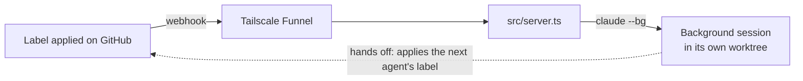
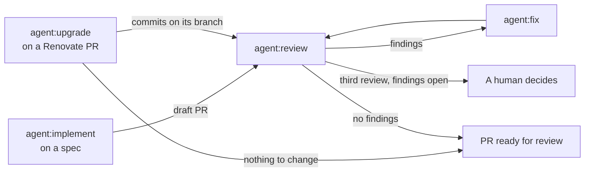

# Claude Agent Factory

Put a label on a GitHub issue or pull request. A Claude Code background session on your machine picks it up.



`TRIGGERS` in `src/session.ts` lists each label, the skill it starts, the effort it runs at, and how its session hands off.

Each session is named `<label> <repo>#<number>`, for example `agent:implement ai#1`.
It works in its own git worktree, `.claude/worktrees/<skill>-<number>`, so two sessions never share a checkout.
Applying the label again reuses that worktree.

## Requirements

- Node, in the range `engines` in the root `package.json` sets. The server runs TypeScript directly, with no build step.
- Claude Code with `claude --bg`, on an account that can run Opus.
- `gh`, logged in. Repo webhooks work with the default `repo` scope.
- Tailscale, logged in. The first `tailscale funnel` run prints a link to allow Funnel on your tailnet.

## Conventions for every project

The server finds everything by convention. Each repo it serves needs:

1. A clone at `$REPOS_DIR/<owner>/<repo>`, matching GitHub's `owner/repo`. With `REPOS_DIR=~/Projects/github`, `acme/app` lives at `~/Projects/github/acme/app`. Sessions run there, not in the folder the server runs from.
2. Claude Code trust. `claude --bg` refuses a folder you haven't trusted.
3. Every label in step 3 of [Add a project](#add-a-project).
4. The pipeline's skills (`create-spec`, `implement-spec`, `implement`, `create-pr` and `review-pr`) and the skills those call, pushed to the default branch. A session's worktree starts from it. Ours install from `jd-solanki/ai`; the root `skills-lock.json` lists where the rest come from.
5. `.claude/worktrees/` in `.gitignore`, or every session's worktree shows up as untracked in your clone.
6. A webhook to this server, using the JSON content type, the `issues` and `pull_request` events, and the secret from `.env`.

## Start the factory

Once per machine, from `apps/software-factory`:

```bash
echo "GITHUB_WEBHOOK_SECRET=$(openssl rand -hex 32)" >> .env
echo "REPOS_DIR=$HOME/Projects/github" >> .env
```

Then, from the repository root:

```bash
pnpm factory
```

In a second terminal:

```bash
tailscale funnel --bg 3456   # the PORT in src/server.ts
tailscale funnel status      # prints the public URL
```

`pnpm factory` runs in the foreground, so the factory stops when its terminal closes.

For the first few minutes after you enable Funnel, webhooks can time out before they reach the server.

## Add a project

Run this from `apps/software-factory` so `.env` loads. The numbers match the conventions above.

```bash
set -a; . ./.env; set +a
REPO=owner/repo
FUNNEL_URL="https://$(tailscale status --json | jq -r '.Self.DNSName | rtrimstr(".")')/"

# 1. Clone to the convention path
gh repo clone "$REPO" "${REPOS_DIR:?run from apps/software-factory so .env loads}/$REPO"

# 2. Trust it: accept the prompt, then /exit
(cd "$REPOS_DIR/$REPO" && claude)

# 3. Labels
gh label create issue:spec -R "$REPO" --force -d "Spec an agent implements unattended"
gh label create issue:AFK -R "$REPO" --force -d "Sub-issue an agent does unattended"
gh label create issue:HITL -R "$REPO" --force -d "Sub-issue a human does"
gh label create issue:HITL-done -R "$REPO" --force -d "The human finished this HITL issue"
gh label create agent:implement -R "$REPO" --force -d "Factory: implement this spec and open a draft PR"
gh label create agent:implementing -R "$REPO" --force -d "Factory: an Implementer run holds this spec"
gh label create agent:review -R "$REPO" --force -d "Factory: review this PR"
gh label create agent:reviewing -R "$REPO" --force -d "Factory: a review run holds this PR"
gh label create agent:fix -R "$REPO" --force -d "Factory: fix this PR's review findings"
gh label create agent:fixing -R "$REPO" --force -d "Factory: a Fixer run holds this PR"
gh label create agent:upgrade -R "$REPO" --force -d "Factory: upgrade the code for this Renovate PR (needs ⬆️ Renovate)"
gh label create agent:upgrading -R "$REPO" --force -d "Factory: an Upgrader run holds this PR"

# 6. Webhook
HOOK_ID=$(gh api "repos/$REPO/hooks" \
  -f "config[url]=$FUNNEL_URL" -f 'config[content_type]=json' \
  -f "config[secret]=${GITHUB_WEBHOOK_SECRET:?run from apps/software-factory so .env loads}" \
  -f 'events[]=issues' -f 'events[]=pull_request' --jq .id)
```

Steps 4 and 5 change the project itself, so commit them there:

```bash
cd "$REPOS_DIR/$REPO"
npx skills@latest add <source> --skill <name>   # once per skill
echo '.claude/worktrees/' >> .gitignore
git add -A && git commit -m "chore: set up agent factory" && git push
```

Check that GitHub reaches the server, in the shell that ran step 6. A ping answers `200`:

```bash
gh api -X POST "repos/$REPO/hooks/$HOOK_ID/pings"
gh api "repos/$REPO/hooks/$HOOK_ID/deliveries" --jq '.[0] | "\(.event) \(.status_code)"'
```

## Use it

Apply a trigger label on GitHub:

- `agent:implement` on an issue that carries `issue:spec`, which is what `/create-spec` files. The session builds the spec's sub-issues, in parallel where none blocks another, opens a draft PR and hands it to the review.
- `agent:review` on a pull request. The review posts each finding as a thread and keeps one summary comment with a score.
- `agent:fix` on a pull request. The session fixes the review's threads and hands the PR back to the review.
- `agent:upgrade` on a Renovate PR, which must carry `⬆️ Renovate`: set it in Renovate's `labels` option. The session reads the release notes in its body, brings the code in line with the new versions, and hands the PR to the review. With nothing to change, it marks the PR ready instead.

You apply the first label. Each session applies the next one:



When a run starts, the server swaps the trigger label for its `…ing` label, which comes off when the session stops with no subagent still running.
Apply the trigger label again to retry or resume. Applied while the `…ing` label is still on, it is removed and nothing starts.

Then, on the factory machine:

```bash
claude agents        # sessions and their state
claude attach <id>   # open one in this terminal
claude rm <id>       # delete it, and its worktree when that is safe
```

Sessions start in your default Claude Code permission mode. A session waiting on an approval stays stuck until you attach to it.

To add a trigger, add a line to `TRIGGERS` in `src/session.ts`, create its label in each repo, and restart the server.

## More

- Contributing, project status and known gaps: [`CONTRIBUTING.md`](./CONTRIBUTING.md)
- Commands: the `scripts` block in [`package.json`](./package.json)
